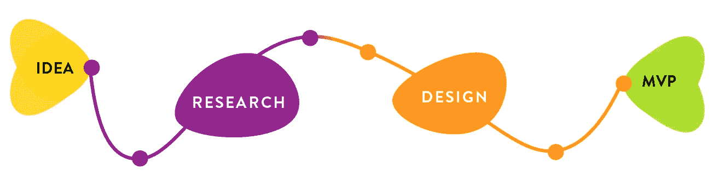

# 放大你的 UX 之路，避免项目枯竭

> 原文：<https://medium.com/geekculture/zoom-in-on-your-ux-path-and-avoid-project-burnout-3fe8b53362c9?source=collection_archive---------54----------------------->

## 为成功选择正确的研究和设计工具

**UX 设计要点:** *项目工具*

为了构建一个最小可行产品(MVP ),我们从一个想法开始，或者，用 UX 的术语，最初的问题陈述。然后，我们进入研究数据收集和分析、用户定义参与、设计构思和实施…