# 放大新的交互构建器功能

> 原文：<https://medium.com/geekculture/zoom-on-the-new-interaction-builder-features-edb73d92c40a?source=collection_archive---------14----------------------->

在[触觉](https://www.interhaptics.com/explore/what-is-haptics)沉浸式体验中，手部交互的逼真程度极其重要。它模糊了虚拟和现实之间的界限，让用户更加沉浸其中。

有了交互构建器，你只需点击几下鼠标，就可以创建像这样很酷的手动跟踪工具:

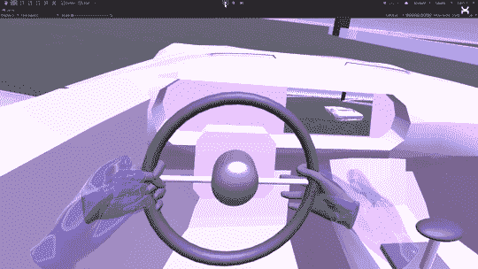

[交互构建器](https://www.interhaptics.com/tools/interaction-builder)是 Interhaptics 的 3D 引擎低代码插件，允许你在 3 次点击内开发逼真的手部交互。该应用程序增加了您的虚拟创作的价值，同时大大减少了手跟踪应用程序的开发时间。

[Interhaptics](https://www.interhaptics.com) ，在 10 月 5 日发布了两个全新的交互构建器功能。双手互动和抓拍已经在[这篇博文](https://www.interhaptics.com/blog/2021/10/05/interaction-builder-new-feature-2-hand-interaction-new-snapping/)中介绍过。

## **深入了解新的交互构建器功能**

Interhaptics SDK for Unity 允许设计简单或复合的交互，可以用一只手或两只手，也可以用一根手指。还可以将交互限制在特定的身体部位，例如右手或左手食指。

交互模块的优势在于它是专门为手部跟踪而构建的，可以实现精确而真实的交互。它是基于产生复杂行为的低级交互的组合。让我们开始吧！

**基本交互砖块:**

自由移动:

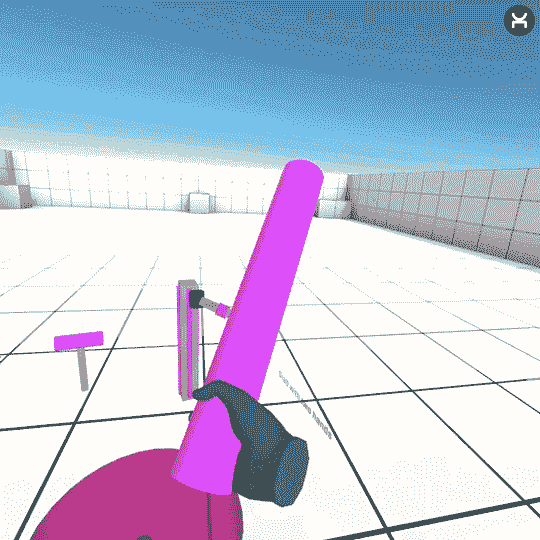

Y 轴旋转的自由位置:

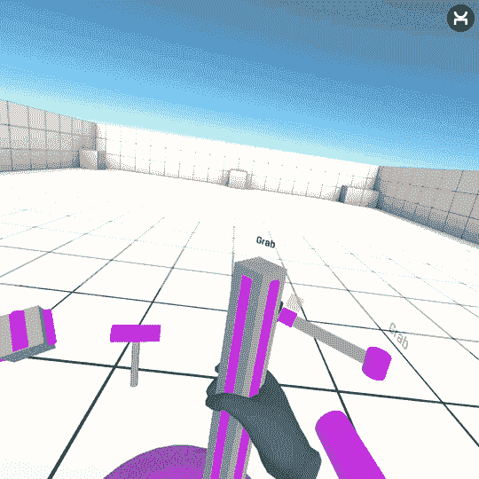

滑动:

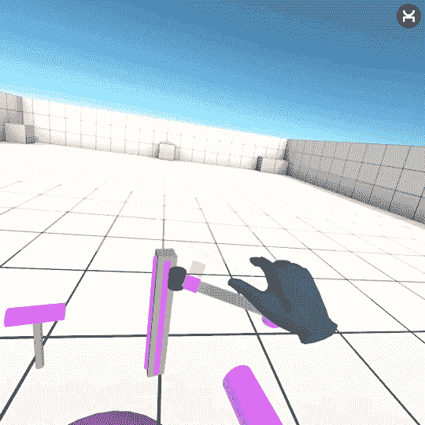

围绕枢轴旋转:

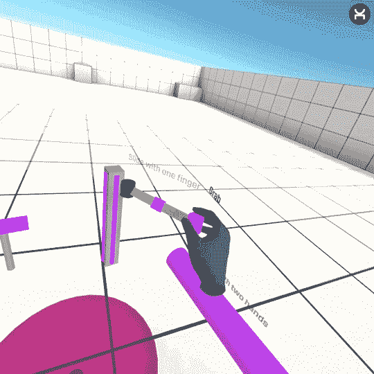

**如何触发:**

抓地力:

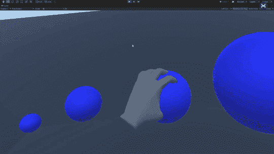

压力:

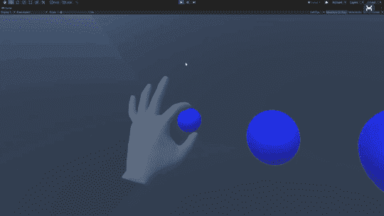

两者:

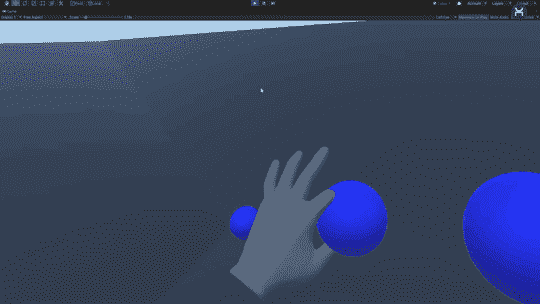

而且在接触时:

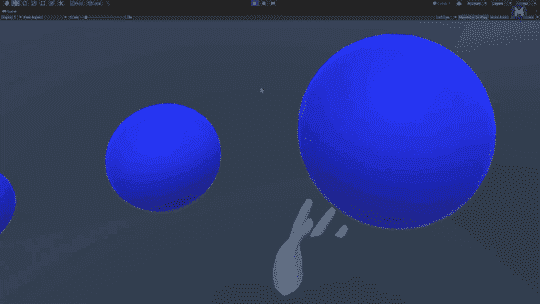

有可能强迫与特定身体部位发生交互

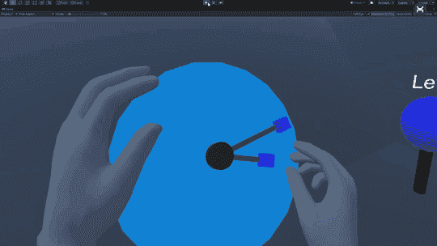

## **手掰**

在交互之上，我们可以使用对象捕捉器来添加一点真实感。该工具模拟手在对象上的姿势。

对于球形对象，可以这样做:

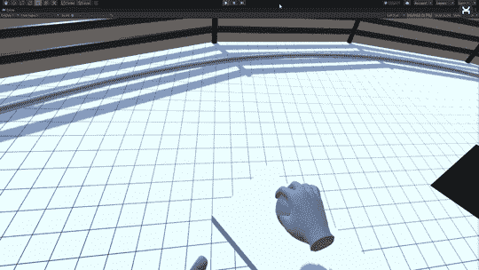

胶囊(由触觉滑块代替):

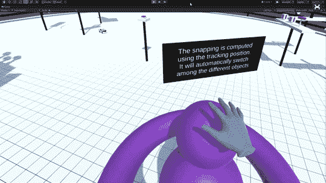

圆柱形物体:

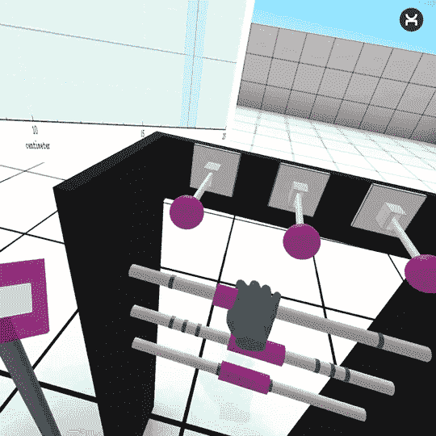

甚至是一个圆环:

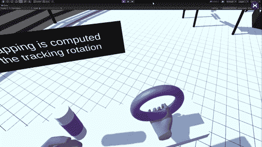

我们可以根据跟踪的位置定义捕捉(对于大对象):

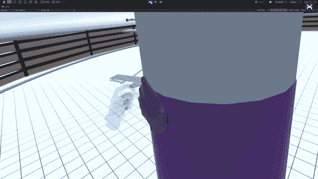

或者根据它的旋转(小物体):

(**位置和旋转**

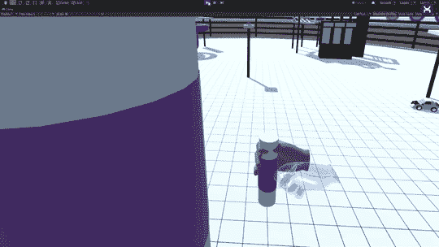

我们可以编辑一只手
或两只手的手指姿势:

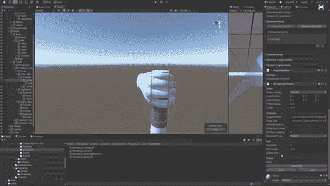

可以在第一个位置(交互开始后的第一帧)阻止手:

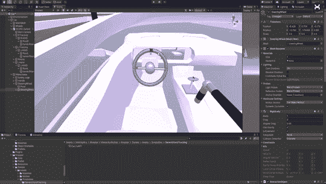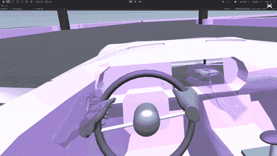

或者让手在原始人周围移动:

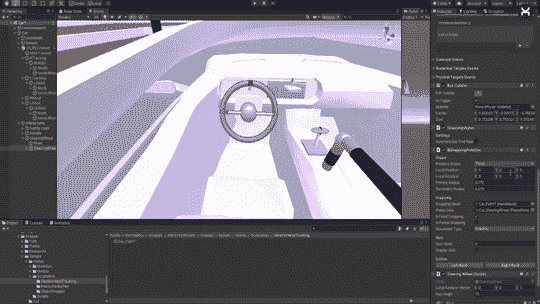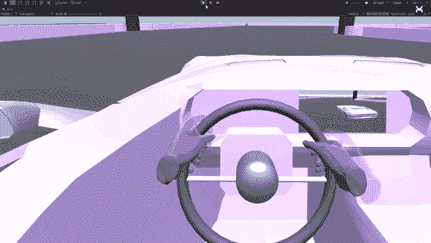

也可以阻止捕捉的方向，以防止手突然翻转:

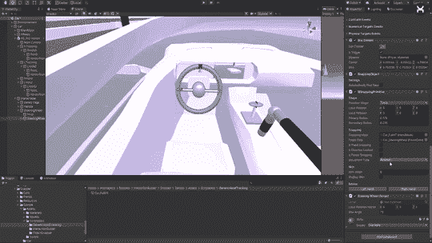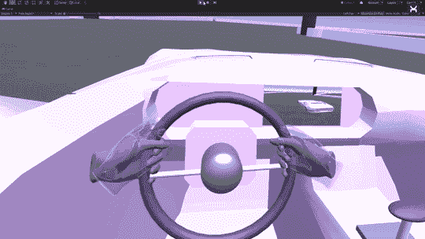

但是也留下一些空闲的手指:

## 增强与触觉的相互作用

抓拍功能与基于手动跟踪的交互相结合，在视觉和实践上创造了真正身临其境的体验。如果你使用任何类型的外骨骼，触觉反馈的使用是必须的。

此外，你可以通过使用[触觉](https://www.interhaptics.com/explore/what-is-haptics)(如果你想使用控制器或者你有一个像 [Senseglove](https://www.interhaptics.com/blog/2021/07/01/sensegloves-dk1-is-now-compatible-with-interhaptics-no-code-experiences-for-exoskeleton-gloves/) 这样的花哨的触觉设备)来改善玩家体验，从而增强我们的互动。您可以在互动时进行游戏:

1.振动

2.口感

3.刚度

例如，我们可以在交互过程中播放一个振动模式，从它的开始或从程序的开始，一次或循环播放。你可以播放一个心跳，一个电话通知甚至是一个幽灵探测器！
依赖于围绕枢轴旋转的旋转角度或滑块移动的距离的纹理。这可以用来表示门的吱嘎声、车轮的凹口或手刹的尖叫(那很吓人……)
一种刚度，保留给力反馈兼容设备。这样就有可能在玩家抓住一个物体时挡住他的手指，以增加互动的真实感，或者甚至在你拉操纵杆时产生阻力。

## **关于触觉的**

[Interhaptics](https://www.interhaptics.com) 是一家专门从事[触觉](https://www.interhaptics.com/explore/what-is-haptics)的软件公司。Interhaptics 为虚拟现实(VR)、混合现实(MR)、移动、增强现实(AR)、haptics Iphone 和 Android 以及控制台应用程序提供手部交互和触觉反馈开发和部署工具。Interhaptics 的使命是促进可扩展的 haptics 生态系统的发展。Interhaptics 致力于为 VR/MR/AR、移动和控制台开发人员社区提供一流的开发工具，以及支持 haptics 的内容在任何支持 haptics 的平台上的互操作性。

