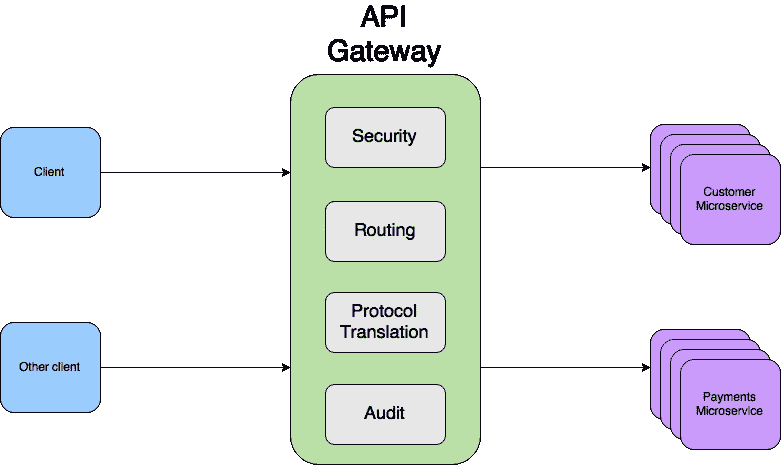
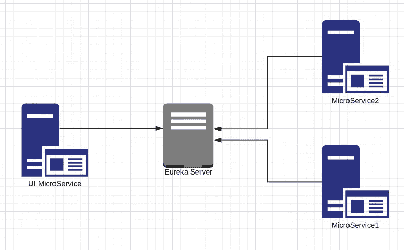
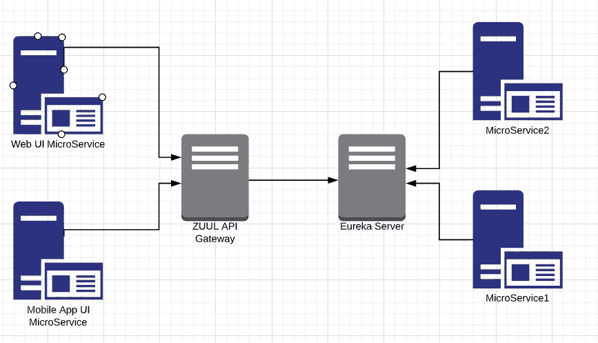
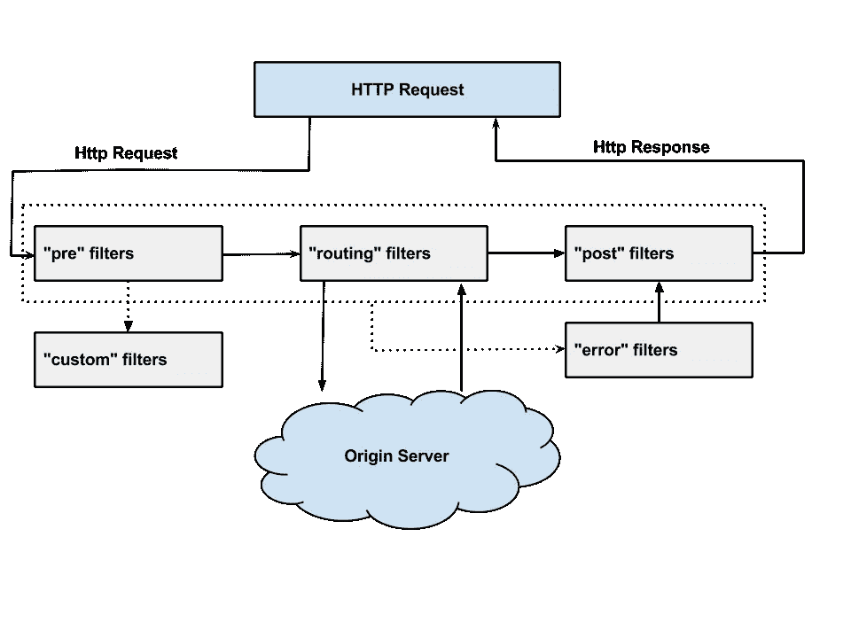

# Zuul API 网关

> 原文：<https://medium.com/geekculture/zuul-api-gateway-2bcdf4dd33e6?source=collection_archive---------0----------------------->

在本教程中，我们主要关注于 **Zuul API 网关**。我们有这么多可用的 API 网关。在**春云**我们有一个 **Zuul API 网关**。如果您在基于 AWS 的环境中工作，那么您将拥有不同的 AWS API 网关。所以你可以用任何一个。

什么是**微服务**？

**微服务**——也称为**微服务**架构——是一种架构风格，将应用程序构建为一组服务。高度可维护和可测试。松散耦合。可独立部署。围绕业务能力组织。

如果你想知道更多关于微服务的细节，请参考我以前的文章。

 [## 单片与微服务架构(第 1 部分)

### 在本教程中，我们将深入了解单片架构和微服务。这里我们关注的是…

kasunprageethdissanayake.medium.com](https://kasunprageethdissanayake.medium.com/monolithic-vs-microservices-architecture-part-1-3bc5d4070a4e) 

## 什么是尤里卡服务器？

**Eureka** Server 是一个保存所有客户端服务应用程序信息的应用程序。每个微服务将注册到 **Eureka** 服务器中，并且 **Eureka** 服务器知道在每个端口和 IP 地址上运行的所有客户端应用。**尤里卡**服务器也被称为发现服务器。有了**网飞尤里卡**每个客户端可以同时充当服务器，把自己的状态复制给连接的对等体。换句话说，客户机检索服务注册中心的所有连接对等体的列表，并通过负载平衡算法向任何其他服务发出所有进一步的请求。

## Zuul API 网关

Zuul 服务器是一个 API 网关应用。它处理所有请求，并执行微服务应用程序的动态路由。它也被称为边缘服务器。Zuul 的构建是为了实现动态路由、监控、弹性和安全性。它还可以将请求路由到多个 Amazon Auto Scaling 组。

例如，**/API/产品**映射到**产品**服务，**/API/用户**映射到**用户**服务。Zuul 服务器动态地将请求路由到相应的后端应用程序。

## 如何在微服务应用中使用 Zuul API 网关？

假设我们有一个名为 Eureka Registry 的注册服务器**，我们有不同的微服务应用。**微服务 1** 和**微服务 2** 。它们部署在不同的主机上，端口也不同。我们也有一个注册在网飞尤里卡的 UI 服务。现在所有的微服务都在尤里卡注册服务器上注册了。**

现在，假设我们需要从 **UI 服务**与**微服务**进行通信，这里的安全性非常危险。在这种场景中，我们需要为所有的微服务提供安全性。假设我们有 100 个微服务，如果您想要在**授权 2** 和 **JWT** 下为所有这 100 个微服务提供安全性，这将会非常危险。我们需要为所有这 100 个微服务编写相同的代码，并且需要进行授权和认证。这可不好。

我们实时做的是，所有的微服务都将部署在一个私有网络中，这样这些微服务就不会暴露给外界。没人能接触到它。那我们怎么保证这里的安全呢？。

然后 Zuul API 网关就出现了。

假设我们有微服务注册中心，我们有多个微服务。所有微服务都在网飞尤里卡注册，我们还有一个 API 网关，它是微服务之一，也是 Spring Cloud 的一部分。所以一旦所有的服务都注册了，所有的服务都可以在网飞尤里卡注册中心找到。现在微服务 1 和微服务 2 在一个私有网络中，它们不暴露在外面。现在，我们如何将 Web UI 微服务传达给微服务 1？

每当来自用户的任何请求到来时，对任何 UI 服务的请求将被发送到 **Zuul API 网关**。Zuul 将把所有的请求路由到相应的微服务。因此，这里不是向 UI 公开所有的微服务，UI 需要向 API 网关发送请求，而网关应该提供安全性(授权和认证)和路由。在这里，我们需要过滤所有的请求(用户),这个特定的用户是否被授权，如果被授权，允许路由到用户到特定的微服务。

在下一个教程中，我们将通过创建一个示例项目来了解如何以编程方式实现这一点。

## Zuul 组件

Zuul 主要有四种类型的过滤器，使我们能够在任何特定交易的请求处理的不同时间线中拦截流量。我们可以为特定的 **URL 模式**添加任意数量的过滤器。

*   **预过滤器** —在请求被路由之前被调用
*   **后归档器** —在请求被路由后调用
*   **路由过滤器** —用于路由请求
*   **错误过滤器** —当处理请求时出现错误时被调用。

## 网关服务的共同责任

*   在网关层应用微服务认证和安全性来保护实际的服务
*   我们可以对进入生态系统的所有流量进行微服务洞察和监控，方法是启用一些日志记录，在边缘获取有意义的数据和统计信息，以便为我们提供准确的生产视图。
*   动态路由可以根据需要将请求路由到不同的后端集群。
*   我们可以通过逐渐增加新集群的流量来进行运行时压力测试，以便在许多场景中评估性能。例如:集群具有新的硬件和网络设置，或者部署了新版本的生产代码。
*   我们可以动态减载。例如:为每种类型的请求分配容量，并丢弃超过限制的请求。
*   我们可以应用静态响应处理，例如:直接在边缘构建一些响应，而不是将它们转发到内部集群进行处理。

## 创建 Zuul API 网关的步骤

*   **尤里卡服务**:尤里卡服务/命名服务器不需要任何改变
*   **生产者服务**:假设我们的微服务 1
*   **消费者服务**:假设我们的微服务 2
*   **Zuul 服务**:编写一个 Zuul 服务，并将所有来自 UI 的请求路由到相应的生产者服务

在下一个教程中，我们将通过创建一个示例项目来了解如何以编程方式设计 Zuul API 网关。

我希望你对 Zuul API 网关有所了解。下节课再见。

谢谢大家！