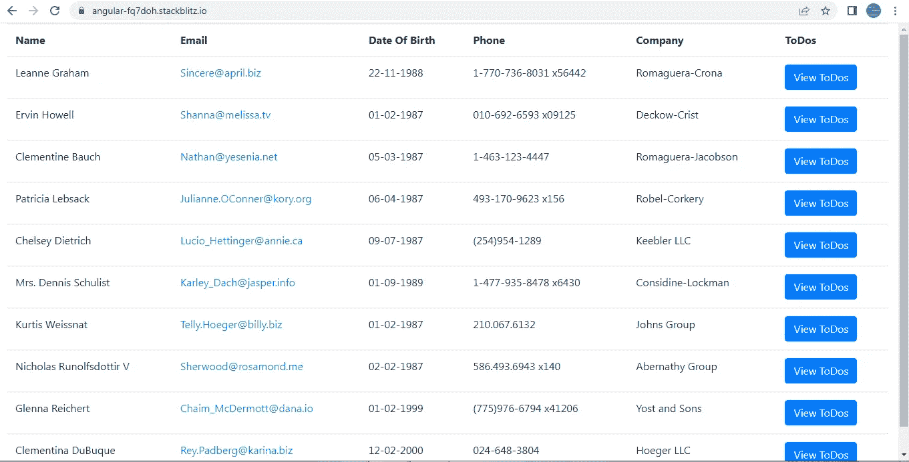

# Angular:不使用 ngtemplateeoutlet 将动态数据传递给嵌套/子级<ng-template>的简单技巧</ng-template>

> 原文：<https://medium.com/geekculture/angular-easy-trick-to-pass-dynamic-data-to-a-nested-child-ng-template-without-using-e1a88d6bceb7?source=collection_archive---------1----------------------->

我在许多 web 开发人员的多个平台上看到过这个问题。如何将数据传递给嵌套在另一个<ng-template>或另一个标签中的<ng-template>？</ng-template></ng-template>

如果我能够使用**ngtemplateoutout**和 **ngTemplateOutletContext** ，这个问题的答案将会非常简单。但是所有的场景都需要这两个属性吗？不完全是。那你会怎么做？

在我的工作项目中，我遇到了一种情况，我必须构建一个表，并且该表中的一些列必须呈现为与其他列不同。当我说“不同”时，我的意思是这些列要么需要使用按钮，要么需要管道来格式化数据等。这不是简单的数据呈现。我求助于使用<ng-template>来解决这个问题。</ng-template>

我用包含 10 个用户数据的下表重新创建了这个场景。我对 ToDos 列使用了**按钮**，对生日列使用了**管道格式**，对 Email 列使用了 **mailto 链接**。其余的列只是按原样呈现文本。



用户数据在这里并不重要。但只是给一个想法，下面是第一个用户对象的结构。

```
{
id: 1,
name: ‘Leanne Graham’,
username: ‘Bret’,
email: ‘Sincere@april.biz’,
dob: ‘11/22/1988’,
address: {
street: ‘Kulas Light’,
suite: ‘Apt. 556’,
city: ‘Gwenborough’,
zipcode: ‘92998–3874’,
geo: {
lat: ‘-37.3159’,
lng: ‘81.1496’,
},
},
phone: ‘1–770–736–8031 x56442’,
website: ‘hildegard.org’,
company: {
name: ‘Romaguera-Crona’,
catchPhrase: ‘Multi-layered client-server neural-net’,
bs: ‘harness real-time e-markets’,
},
},
```

**AppComponent 类:**

**表格标题**包含表格中要显示的标题列表。**表体**包含我们将从 JSON 访问的属性列表，以显示表中的值。

如果有多个列相同但数据不同的表，这种方法会很有帮助。

在 **ngOnInit()** 中，我们正在遍历包含用户数据的**用户变量**。我们真的不需要每个对象中的所有属性。迭代的目的是获取我们需要的表的属性，将其添加到对象 **obj** 中，然后将该对象 obj 推入新属性 **usersList** 。

usersList 是表中使用的最后一个数组。

当我们点击表格**待办事项栏**中的**查看待办事项**按钮时，会执行**视图()**。添加这个方法的目的只是为了说明用户数据可以从< ng-template >的类中访问。

**AppComponent 模板:**

我们通过迭代 **tableHeaders** 属性构建了表头。

```
<tr> <th *ngFor=”let header of **tableHeaders**”>{{ header }}</th> </tr>
```

为了构造表体，我们遍历了 **usersList** 数组，并且在每次迭代中，我们遍历了**表体**数组。我们对 **email、todos 和 dob** 属性(对应于 email、ToDos 和出生日期列)使用引用 **special** 的模板，对其他属性(对应于其他列)使用引用 **regular** 的模板。

```
<tr *ngFor=”**let user of usersList**”> 
<td *ngFor=”**let option of** **tableBody**”> 
<span *ngIf=” ![‘email’, ‘todos’, ‘dob’].includes(option); then regular; else special “ >
</span><!---the templates are placed here-->**<ng-template #special>  **        
<ng-container **[ngSwitch]="option"**>            
<span ***ngSwitchCase="'email'"**>              
<a **href="mailto:{{ user[option] }}"**>{{ user[option] }}</a>            </span> <span ***ngSwitchCase="'dob'"**>              
<label>{{ user[option] **| date: 'dd-MM-YYYY'** }}</label>            </span> <span ***ngSwitchCase="'todos'"**>              
<button class="btn btn-primary" **(click)="view(user.id)"**>                View ToDos</button>            
</span>          
</ng-container>        
</ng-template> **<ng-template #regular>**          
<label>{{ user[option] }}</label>        
</ng-template></td>
</tr>
```

请注意< ng 模板>T11 的**位置。它们在 **< td >** 标签内，因此它们可以访问外部迭代**的**用户变量，也可以访问内部迭代**的**选项变量。**

同样，如果子节点<ng-template>嵌套在父节点<ng-template>中，那么子节点也可以轻松访问传递给父节点<ng-template>的所有数据。</ng-template></ng-template></ng-template>

您可以查看下面的完整工作示例。

[](https://stackblitz.com/edit/angular-fq7doh?file=src/app/app.component.html) [## 角形(叉形)堆叠

### 一个基于 rxjs，tslib，core-js，zone.js，@angular/core，@angular/forms，@angular/common 的 angular-cli 项目…

stackblitz.com](https://stackblitz.com/edit/angular-fq7doh?file=src/app/app.component.html)